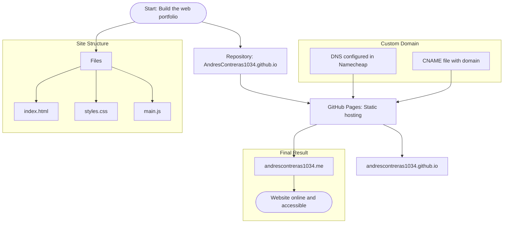

```mermaid
graph TD

Start([Start: Build the web portfolio])
Start --> Files
Start --> Repo

subgraph Site Structure
  Files --> HTML[index.html]
  Files --> CSS[styles.css]
  Files --> JS[main.js]
end

Repo[Repository: AndresContreras1034.github.io]
Repo --> GitHubPages[GitHub Pages: Static hosting]
GitHubPages --> WebGitHub[andrescontreras1034.github.io]

subgraph Custom Domain
  DNS[DNS configured in Namecheap]
  CNAME[CNAME file with domain]
end

DNS --> GitHubPages
CNAME --> GitHubPages

GitHubPages --> WebFinal[andrescontreras1034.me]

subgraph Final Result
  WebFinal --> End([Website online and accessible])
end

```
