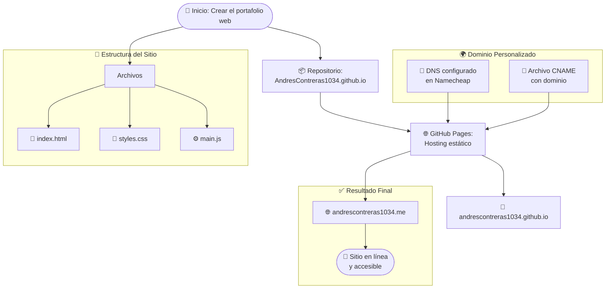

```mermaid
 graph TD

Start([🚀 Inicio: Crear el portafolio web])

Start --> Archivos
Start --> Repo

subgraph "📁 Estructura del Sitio"
  Archivos --> HTML["📄 index.html"]
  Archivos --> CSS["🎨 styles.css"]
  Archivos --> JS["⚙️ main.js"]
end

Repo["📦 Repositorio:<br>AndresContreras1034.github.io"]
Repo --> GitHubPages["🌐 GitHub Pages:<br>Hosting estático"]
GitHubPages --> WebGitHub["🔗 andrescontreras1034.github.io"]

subgraph "🌍 Dominio Personalizado"
  DNS["🧭 DNS configurado<br>en Namecheap"]
  CNAME["📄 Archivo CNAME<br>con dominio"]
end

DNS --> GitHubPages
CNAME --> GitHubPages

GitHubPages --> WebFinal["🌐 andrescontreras1034.me"]

subgraph "✅ Resultado Final"
  WebFinal --> Fin(["🎉 Sitio en línea<br>y accesible"])
end 
```
