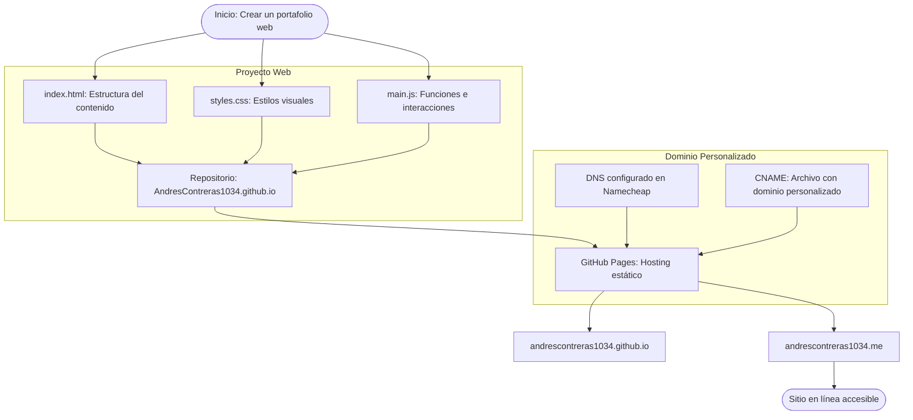

```mermaid
graph TD

Start([Inicio: Crear un portafolio web]) --> HTML[index.html: Estructura del contenido]
Start --> CSS[styles.css: Estilos visuales]
Start --> JS[main.js: Funciones e interacciones]

subgraph Proyecto Web
  HTML --> Repo[Repositorio: AndresContreras1034.github.io]
  CSS --> Repo
  JS --> Repo
end

Repo --> GitHubPages[GitHub Pages: Hosting estático]
GitHubPages --> Publicado[andrescontreras1034.github.io]

subgraph Dominio Personalizado
  CNAME[CNAME: Archivo con dominio personalizado]
  DNS[DNS configurado en Namecheap]
  DNS --> GitHubPages
  CNAME --> GitHubPages
end

GitHubPages --> DominioFinal[andrescontreras1034.me]
DominioFinal --> Final([Sitio en línea accesible])

```
